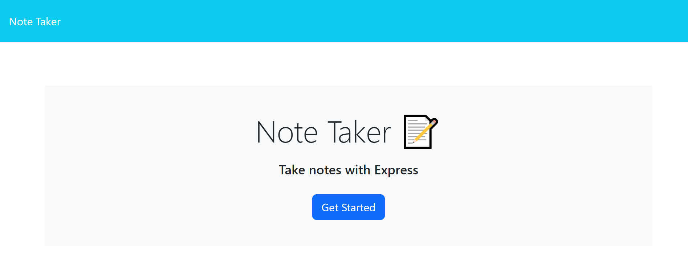
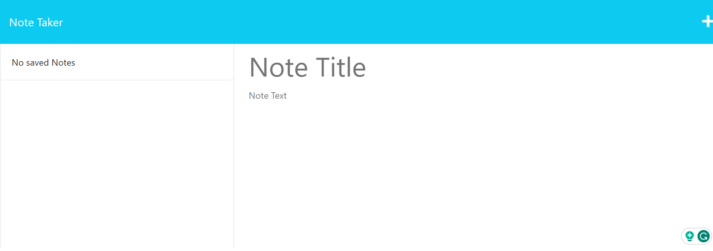

  # CC Note Pade

  ## Description
  This is a website that allows for the user to write and save notes to be used at a later date. When notes no longer become applicable the user will have the ability to delete the notes. 

  ## Table of Contents
  - [Installation](#installation)
  - [Usage](#usage)
  - [Credits](#contributing-credits)
  - [License](#license)

  ## Installation
  There is no need to install the application. Instead go to "website here" and the user will be able to use the web application. 

  ## Usage
  To use this application the user will need to go to "insert webpage here" and then click on the button titled "Take notes with Express." 
  
  

  The user will then be able to add any notes they want to add which will be added to the left hand column. By clicking on the note on the left hand column the user will be able to look at the text within the note. To create a new note hit the plus button, to save a note enter data and then hit the save button, and to delete a note click on the trash button. 

  

  ## Contributing Credits
  I used some of the helpers from the student mini-project to help with data manipulation to and from the database file. 
      
  ## License

  MIT
 
  ---
  ## Questions?
  If you would like to see some of my other work go to https://github.com/cecrouch01.
  If you have any additional questions feel free to contact me at: cecrouch01@gmail.com
  